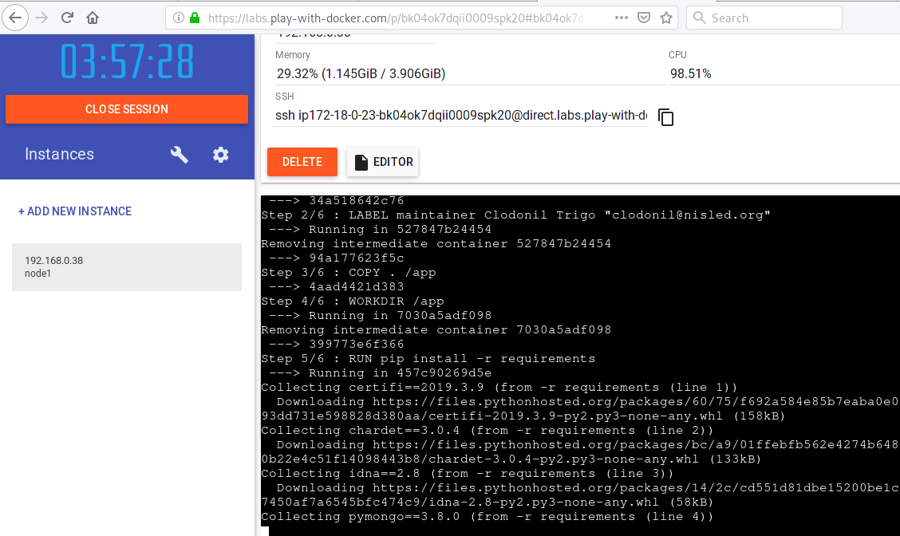
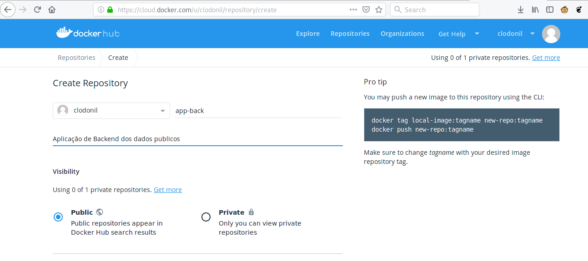

# Python com MongoDB e Flask

Esse exercício tem como objetivo desenvolver um infográfico com os dados dos deputados federais obtidos através do site [Portal Brasileiro de Dados Abertos](https://dadosabertos.camara.leg.br/).

Arquitetura da solução proposta foi a seguinte:


* **app-back:** Função em Python para conectar na API dos dados abertos, processar e gravar no `MongoDB`.
* **app-front:** Aplicação em Python com Flask para apresentar os dados consolidados no `MongoDB`.

> O AppBack vai ser executado 1 vez ao dia (agendamento), o mesmo pode ser acionado por qualquer `scheduler`. Nesse exercício vamos utilizar o `scheduler` do  Python para fazer essa tarefa, não é a melhor solução.


## Desenvolvimento

Para o desenvolvimento local, vamos utilizar o container do `MongoDB`.

Para iniciar o `MongoDB`:

```
docker run -d -p 27017-27019:27017-27019  --name mongodb mongo:latest
```

Todo o desenvolvimento do `AppBack` e do `AppFront` pode ser visualizada na basta [backend](backend) e na [frontend](frontend).

O `Dockerfile` para criação das images dos container está no diretório de cada código.
 
Criando a imagem Docker:

Entre no diretório `backend` e execute:

```
docker build -t clodonil/app-back:latest .
```
Entre no diretório `frontend` e execute:

```
docker build -t  clodonil/app-front:latest .
```

Caso você não tenha o docker instalado no seu computador, pode utilizar o [labs.play-with-docker.com](https://labs.play-with-docker.com) para realizar o `build` do container.

O `Play Docker` cria uma instância por 4 horas, tempo suficiente para você realizar todos os `builds` e testes.

É necessário criar uma conta no [DockerHub](https://hub.docker.com/) para fazer login.

> Após realizar o login no site, crie uma nova instância na opção (Add New Instance)

Com a instância criada, clone o projeto:

```bash
$ git clone https://github.com/clodonil/python-mongodb-flask.git
```
  
 

## Publicando a Imagem

Após o `build` da imagem, vamos publicar a imagem no [DockerHub](https://hub.docker.com/). Após realizar o login, crie um novo repositório.



Com o repositório criado, volte no terminal que a imagem foi criado e realize os seguintes passos para publicar a image.


1. Realize o login no dockerHub pelo terminal
```bash
docker login
```

2. Realizando o Push da imagem.

```bash
docker push clodonil/app-back:tag
```
Verifique no site [DockerHub](https://hub.docker.com/) se a imagem foi publicada.

> Esse processo deve ser feito tanto para o app-back e para o app-front. 

## Orquestrando as imagens

Para finalizer, vamos utilizar o `docker-composer` para orquestrar as images de container. No exemplo abaixo, estamos subindo:

- mongodb
- app-back
- app-front

```yaml
version: '3'
services:
  mongodb:
    container_name: mongodb
    image: mongo:latest
    ports:
      - 27017-27019:27017-27019

  backend:
    container_name: backend
    image: clodonil/app-back:latest
    depends_on:
      - mongodb
    links:
      - mongodb

  frontend:
    container_name: frontend
    image: clodonil/app-front:latest
    ports:
      - 8080:8080
    depends_on:
      - backend
    links:
      - mongodb
      - backend
```

Para inicializar todas os container execute o seguinte comando:

```bash
docker-composer up -d
```

Aplicação pode ser acessada na porta 8080:


Referência:

- [MongoDB](https://medium.com/grupy-rn/trabalhando-com-python-e-mongodb-1d23ee042658)
- [CreateTable](https://www.w3schools.com/python/python_mongodb_create_db.asp)
- [Insert](https://www.w3schools.com/python/python_mongodb_insert.asp)
